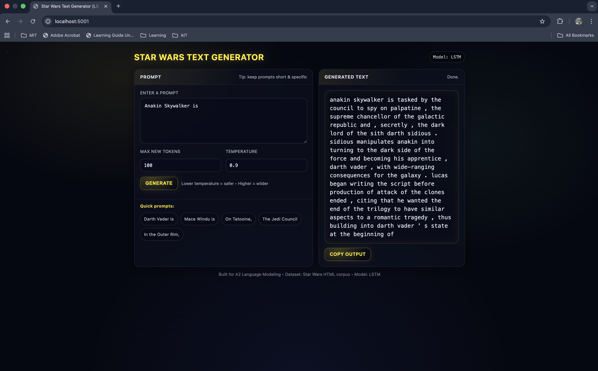
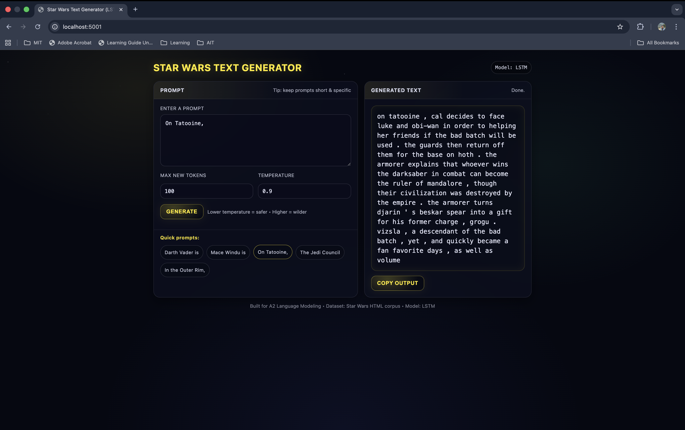

# A2 – Language Modeling with LSTM (Star Wars Text Generator)

## Overview

This project implements a word-level LSTM language model trained on Star Wars–related textual data.
The model is trained to perform next-token prediction and is deployed as a Flask web application that generates text continuations given a user prompt.

The project is completed in three main parts:

Dataset acquisition and preprocessing

Language model training

Web application for text generation

## Task 1: Dataset Acquisition
Dataset Description

The dataset is sourced from the following public GitHub repository:
https://github.com/AlbertoFormaggio1/star_wars_unstructured_dataset/

The dataset consists of multiple HTML files, where each file contains textual information related to a Star Wars character, location, or concept. The content is unstructured and narrative in nature, making it suitable for training a language model.

Note: The dataset is used strictly for non-commercial academic purposes as part of this coursework.

## Data Preprocessing

Since the dataset is provided in HTML format, the following preprocessing steps were applied: 

1. All .html files were iterated programmatically.

2. HTML tags, scripts, and navigation elements were removed using BeautifulSoup.

3. Plain text was extracted and cleaned by normalizing whitespace.

4. Each HTML file was treated as an individual document.

5. All documents were concatenated logically (in code) to form a single training corpus.

6. The final output of this step is a cleaned text corpus stored as starwars_corpus.txt


This corpus serves as the input for tokenization and model training.

## Task 2: Language Model Training
Tokenization and Numericalization

A word-level tokenization approach was used, consistent with lecture materials on LSTM language models.

Tokenization: torchtext basic_english tokenizer

Special tokens:
***< pad >***,
***< unk >***

Vocabulary was built from the full corpus. Each word token was mapped to an integer ID (stoi), and the inverse mapping (itos) was also stored. The corpus was converted into a sequence of token IDs, which were then segmented into fixed-length sequences for training.

## Training Data Construction

For causal language modeling:

Input sequence: tokens [t₁, t₂, ..., tₙ]

Target sequence: tokens [t₂, t₃, ..., tₙ₊₁]

This allows the model to learn next-word prediction.

## Model Architecture

The language model is implemented using PyTorch and consists of:

* Embedding layer

* Multi-layer LSTM

* Fully connected output layer

* Cross-entropy loss for optimization

---

Key hyperparameters:

Embedding dimension: 128

Hidden dimension: 256

Number of LSTM layers: 2

Optimizer: Adam

Loss function: CrossEntropyLoss

---

## Training Process

The dataset was split into training and validation sets. The model was trained for multiple epochs. Training and validation losses were monitored through each epoch.

After training, the following artifacts were saved:

artifacts/
├── starwars_lstm_model.pt      # trained model weights
├── vocab.json      # vocabulary mappings (stoi / itos)


These artifacts are reused during deployment.

---

## Task 3: Web Application

* Technology Stack

* Backend: Flask

* Model inference: PyTorch

* Frontend: HTML (Jinja2 templates)

Application Structure

```
A2_Language_Modeling/
├── app/
│   ├── app.py
│   └── templates/
│       └── index.html
├── artefacts/
│   ├── starwars_lstm_model.pt
│   └──vocab.json
├── A2.ipynb
└── README.md
```

## How the Web App Interfaces with the Language Model

Startup
---

The Flask app loads the trained LSTM model and vocabulary artifacts once at startup. The model is set to evaluation mode.

User Input
---

The user enters a text prompt in the web interface.

Additional parameters include:

maximum number of generated tokens

temperature for sampling

Preprocessing
---

The prompt is tokenized using the same tokenizer as training.

Tokens are converted into integer IDs using the stored vocabulary.

Text Generation
---

The LSTM processes the prompt to initialize its hidden state.

New tokens are generated iteratively using temperature-scaled sampling.

The generation process continues until the specified token limit is reached.

Postprocessing
---

Generated token IDs are mapped back to words.

The final generated text is displayed in the browser.

Running the Web Application
Install dependencies
pip install flask torch torchtext

Start the app
cd app
python app.py

Open in browser
http://127.0.0.1:5001

Output Interfaces
---
Users can manually input the starting words.

<br>

Users can also use quick shortcut word in the Quick prompts section.

<br>

Notes
---

The model learns linguistic and semantic patterns, not explicit Star Wars timelines.

Attention mechanisms were studied separately for conceptual understanding but were not required for this assignment.

The system demonstrates an end-to-end NLP pipeline from raw text to deployed language model.
<br>

Author <br>
Kaung Hein Htet <br>
AIT – NLP Coursework