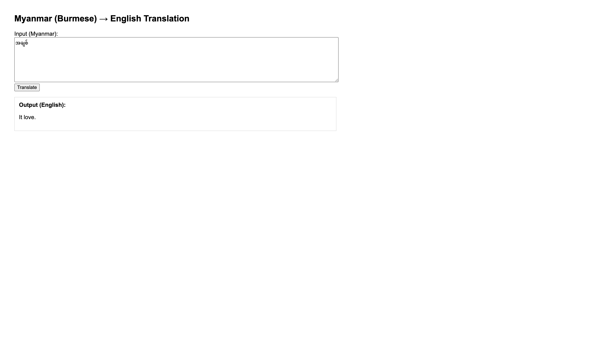

## A3 – Own Machine Translation System (Myanmar → English)

This project implements a **neural machine translation (NMT)** system for **Myanmar (Burmese) to English** using a **Seq2Seq architecture with attention mechanisms**. 

Two attention variants are implemented and compared through - 

- **General Attention**
- **Additive Attention**

The best-performing model  is deployed in a simple **Flask web application**.

---

## 1. Dataset

### Source
The **TED2020 Myanmar–English parallel corpus** from the OPUS project is used.

- Language pair: `my` (Myanmar) → `en` (English)
- Source: https://opus.nlpl.eu/datasets/TED2020?pair=en&my

### Data Split

The dataset is divided into three components as follows. 

- Training set  
- Validation set  
- Test set  

Only the **training set** is used for tokenizer training to prevent data leakage.

---

## 2. Text Preprocessing

### SentencePiece Tokenization
We apply **SentencePiece BPE** with a **shared vocabulary** for source and target languages.

- Model type: `BPE`
- Vocabulary size: `8000`
- Special tokens:
  - `<pad>` = 0
  - `<bos>` = 1
  - `<eos>` = 2
  - `<unk>` = 3

To improve efficiency, I removed 
- Empty lines are removed
- Very long lines are filtered
- A maximum of 30,000 lines are sampled

Tokenizer files are stored in artefacts.
- artefacts/
- spm_my_en.model
- spm_my_en.vocab


---

## 3. Model Architecture

### Encoder
- Embedding layer  
- **Bidirectional LSTM**  
- Projection layer to match decoder hidden size  

### Decoder
- Embedding layer  
- LSTM  
- Attention mechanism  
- Output projection layer  

---

## 4. Attention Mechanisms

### General Attention
Computes attention using a dot product between the encoder outputs and the decoder hidden state.

### Additive Attention (Bahdanau)
Computes attention scores using a feed-forward network:

\[
\alpha_{t,s} = v^\top \tanh(W_1 h_s + W_2 h_t)
\]

This formulation provides more flexible alignment modeling.

---

## 5. Training Setup

- Embedding dimension: `128`
- Hidden dimension: `128`
- Optimizer: Adam
- Loss: Cross-entropy (padding ignored)
- Batch size: `32`
- Length-based batching
- Maximum sequence length: 60 tokens

Both models are trained under identical settings.

---

## 6. Evaluation

### BLEU Score
Models are evaluated on the test set using BLEU.

| Model | Train Loss| Training PPL |Validation Loss | Validation PPL | BLEU |
|------|-----------:|-------------:|---------------:|---------------:|-----:|
| General Attention | 4.761435 | 116.913635 | 5.752427 | 314.954146| 1.529256|
| Additive Attention | 4.582834 | 97.791187 | 5.618843 | 275.570333| 2.133739|

The **Additive Attention** model achieves the best overall performance.

---

## 7. Attention Visualization

Attention heatmaps are generated for selected test examples:
- Short sentence
- Medium-length sentence
- Longer sentence

Saved figures:
- plots/
- attn_additive_0.png
- attn_additive_10.png
- attn_additive_50.png


These visualizations demonstrate clearer token alignments for the Additive Attention model.

---

## 8. Model Artefacts

Final saved artefacts:
- artefacts/
- seq2seq_additive.pt
- seq2seq_general.pt
- spm_my_en.model
- spm_my_en.vocab


The Additive Attention model is selected for deployment.

---

## 9. Web Application

A simple **Flask-based web application** is provided to demonstrate inference.

### Translation Pipeline
1. User inputs Myanmar text  
2. SentencePiece tokenization  
3. Encoding using the trained Seq2Seq model  
4. Greedy decoding  
5. SentencePiece detokenization  

---

## 10. How to Run the Application

### Step 1: Install dependencies
```bash
pip install flask torch sentencepiece numpy
```


### Step 2: Project structure
A3_Own_Machine_Translation/
  app/
    app.py
    templates/
      index.html
  artefacts/
    seq2seq_additive.pt
    spm_my_en.model
    spm_my_en.vocab

### Step 3: Run the ap
cd app
python app.py

### Step 4: Open in browser
http://127.0.0.1:5001


# Output 

<br>

It is not the accurate translation but it is close. I believe my model is doing not well because of the smaller dataset, lower weighted layer and also the nature of my native language. 