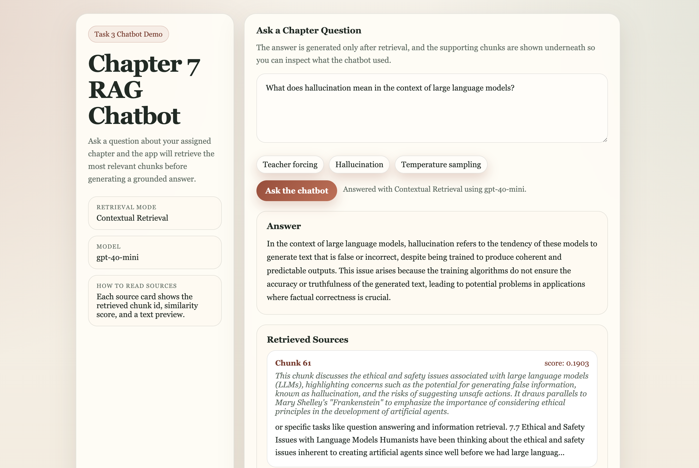

# A6: Naive RAG vs Contextual Retrieval

This project implements the three assignment tasks for Chapter 7, **Large Language Models**.

- **Task 1** prepares the local chapter PDF, cleans the text, creates chunks, and writes 20 QA pairs.
- **Task 2** compares **Naive RAG** and **Contextual Retrieval** using OpenAI for answer generation and ROUGE-based evaluation.
- **Task 3** provides a small Flask chatbot interface for asking chapter-related questions and viewing retrieved sources.

## Project Structure

- `A6.ipynb`: main notebook containing Task 1 and Task 2
- `rag_utils.py`: helper functions for retrieval, generation, and evaluation
- `app/app.py`: Flask chatbot backend
- `app/templates/index.html`: chatbot frontend
- `assets/Chapter_7.pdf`: assigned local chapter PDF
- `assets/NLP_2026_A6_RAG_Techniques.pdf`: assignment brief
- `assets/chatbot.png`: screenshot of the chatbot interface

## Requirements

Install the packages before running the notebook or chatbot:

```bash
cd /Users/kaungheinhtet/Desktop/AIT_NLP_Assignments/A6_RAG_Techniques
python -m pip install -r requirements.txt
```

Create `.env` with your OpenAI API key:

```env
OPENAI_API_KEY=your_key_here
```

## How To Run

### Notebook

Open `A6.ipynb` and run the cells in order to reproduce:

- Task 1 preprocessing
- Task 2 Naive RAG vs Contextual Retrieval
- ROUGE-1, ROUGE-2, and ROUGE-L evaluation

### Chatbot

Run the Flask app from the project root:

```bash
cd /Users/kaungheinhtet/Desktop/AIT_NLP_Assignments/A6_RAG_Techniques
python app/app.py
```

Then open:

```text
http://127.0.0.1:5000
```

## Output

The main generated outputs for this assignment are:

- `artefacts/chapter_7_raw.txt`: raw extracted text from the PDF
- `artefacts/chapter_7_cleaned.txt`: cleaned chapter text
- `artefacts/chapter_7_chunks.json`: original chunk cache for Naive RAG
- `artefacts/chapter_7_contextual_chunks.json`: contextualized chunk cache for Contextual Retrieval
- `artefacts/qa_pairs_chapter_7.json`: 20 question-answer pairs used for evaluation
- `artefacts/task2_full_results_chapter_7.json`: full Task 2 results including retrieved chunk ids
- `answer/response-st126477-chapter-7.json`: final submission JSON in the assignment format
- `assets/chatbot.png`: screenshot of the Task 3 chatbot UI

## Chatbot Screenshot


