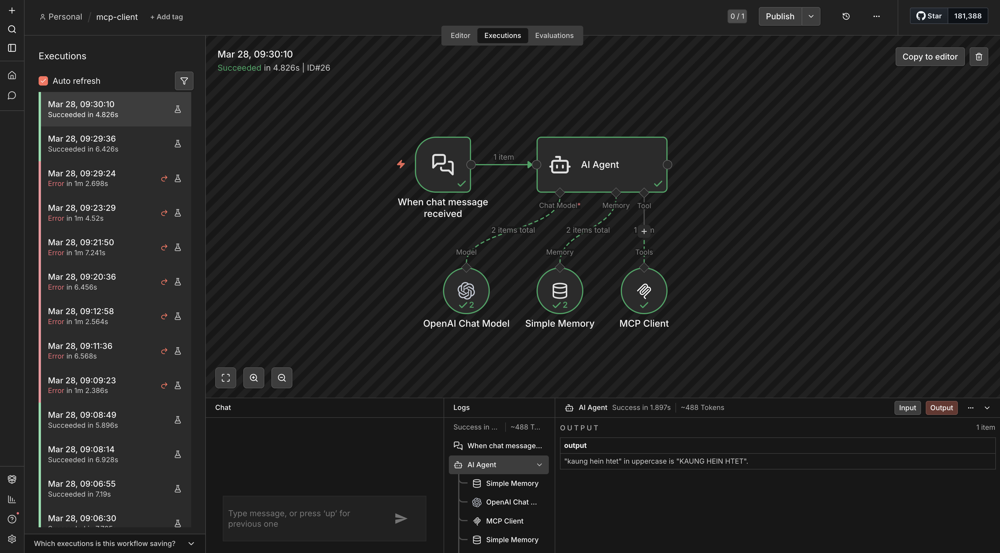
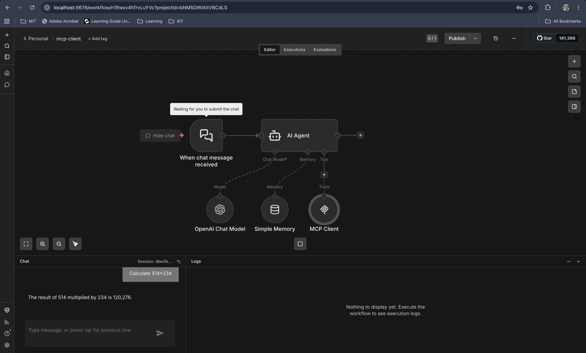
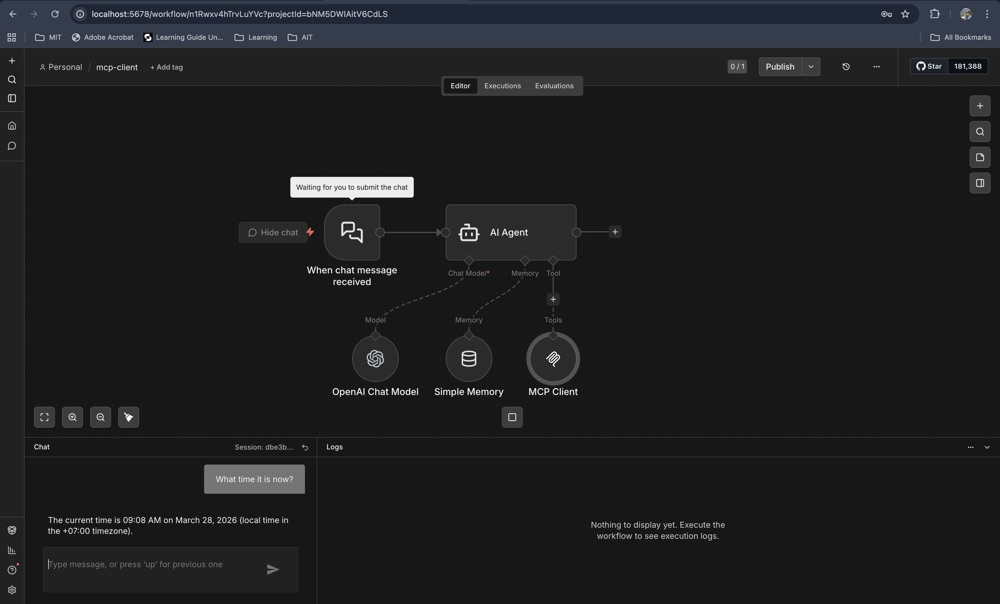
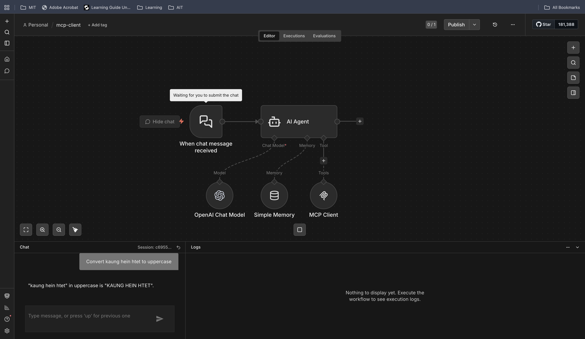
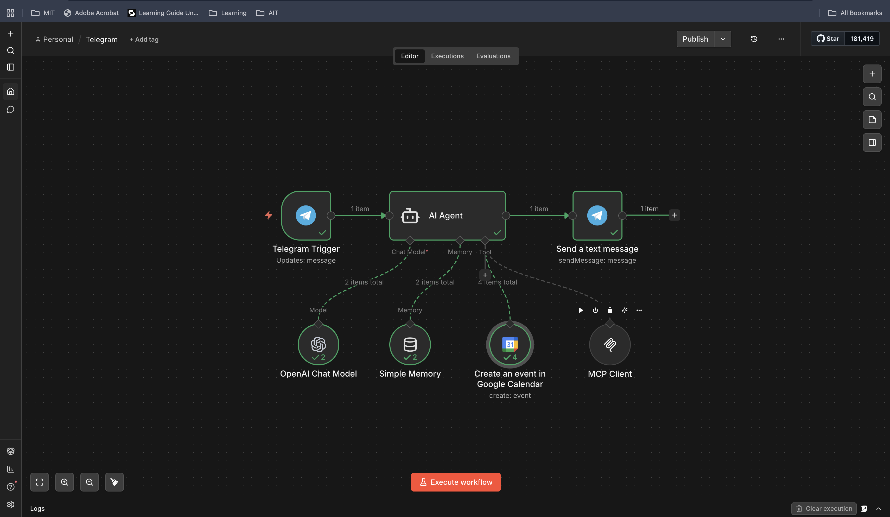
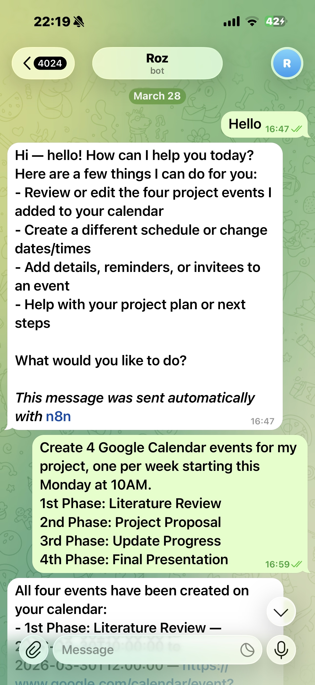
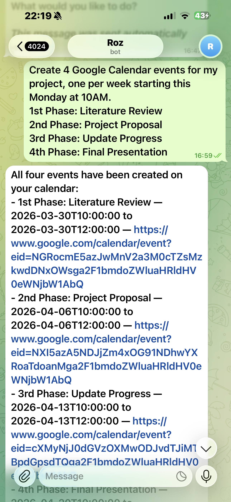
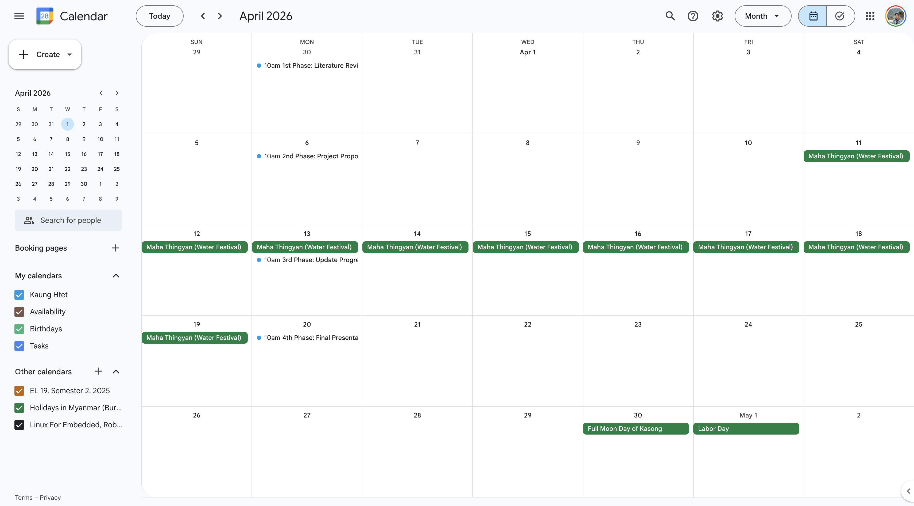

# Assignment 7: MCP Server, AI Agent, and External Tool Integration

This folder contains my submission for Assignment 7 of `AT82.05 Artificial Intelligence: Natural Language Understanding (NLU)`. The goal of the assignment is to build an integrated AI agent ecosystem with the Model Context Protocol (MCP), deploy it in `n8n`, expose it through `ngrok`, and connect the agent to external services such as `Telegram` and `Google Calendar`.

The implementation in this folder documents a local `n8n` setup backed by `PostgreSQL`, an MCP server workflow with internal tools, and an AI agent workflow that can be extended to real-world scheduling tasks. The screenshots in `assets/` are used as submission evidence for both Task 1 and Task 2.

## Assignment Summary

The PDF brief (`NLP_2026_A7_MCP_n8n.pdf`) asks for two major deliverables:

1. `Task 1`: Deploy `n8n` locally with Docker, expose it to the internet with `ngrok`, create an MCP server workflow with at least three tools, and connect an AI agent client to that MCP server.
2. `Task 2`: Connect the agent to `Telegram`, integrate `Google Calendar`, and verify that the agent can create and check project schedule events through chat.

## Repository Contents

- `docker-compose.yaml`: Docker setup for `n8n` and `PostgreSQL`
- `.env.key`: example environment variables for database settings and `ngrok`
- `assets/`: screenshots showing the implemented workflows and tool integrations
- `NLP_2026_A7_MCP_n8n.pdf`: assignment specification

## Local Infrastructure

The local environment is defined in `docker-compose.yaml`:

- `postgres:16-alpine` is used as the persistent database for `n8n`
- `n8n` runs on port `5678`
- the application timezone is configured as `Asia/Bangkok`
- `WEBHOOK_URL` is routed through `NGROK_URL` so webhooks and MCP endpoints can be reached from outside the local machine

The provided `.env.key` acts as a template for the required environment variables:

```env
DB_USER=n8n_admin
DB_PASSWORD=password
DB_NAME=n8n_db
NGROK_URL=https://xxxx-xxx-xxx.ngrok-free.app
```

To run this setup locally:

1. Create a `.env` file from `.env.key`.
2. Start the services with `docker compose up -d`.
3. Open `http://localhost:5678`.
4. Start `ngrok` and update `NGROK_URL` so external webhooks point to the active public URL.

## Task 1: MCP Infrastructure and Server Setup

For Task 1, the system is organized around a local `n8n` deployment and a dedicated MCP server workflow. The MCP server exposes internal tools that can be discovered and called by a separate AI agent workflow. Based on the workflow screenshots, the implementation includes the required three internal tools:

- `Calculator`
- `Date/Time`
- `Text Formatter`

The overall workflow structure is shown below.



The individual MCP tools are shown in the following screenshots.

### Calculator Tool

This tool provides arithmetic support to the MCP server so the agent can delegate calculation requests instead of handling them only through the language model.



### Date/Time Tool

This tool allows the agent to retrieve or format time-related information, which is useful for scheduling and calendar-oriented requests.



### Text Formatter Tool

This tool supports text manipulation inside the MCP server workflow and expands the range of structured operations that the agent can perform.



## Task 2: Telegram and Google Calendar Integration

Task 2 extends the agent from a local tool-using workflow into a practical assistant that can communicate through `Telegram` and manage events in `Google Calendar`.

From the submitted screenshots, the agent is connected to external messaging and calendar services so that scheduling instructions can be sent through chat and reflected as calendar events. According to the assignment brief, the project schedule should include these four phases:

- `1st Phase`: Literature Review
- `2nd Phase`: Project Proposal
- `3rd Phase`: Update Progress
- `4th Phase`: Final (Presentation)

### Telegram-Based Agent Interaction

The following screenshot documents the Task 2 workflow that connects the agent to `Telegram` and enables user interaction through messages.



### Google Calendar Verification

The next screenshot shows the resulting events in `Google Calendar`, which is the required evidence that the workflow can create and manage project schedule entries.

Chats From Telegram





Google Calendar 



## What This Submission Demonstrates

This submission satisfies the main goals of the assignment:

- a local `n8n` environment deployed with Docker
- public webhook support through `ngrok`
- an MCP server workflow with at least three internal tools
- an AI agent workflow that can call MCP tools
- integration with `Telegram` for conversational interaction
- integration with `Google Calendar` for schedule creation and verification

## Notes

This folder currently contains the infrastructure file and screenshot evidence, but not exported `n8n` workflow JSON files. For that reason, this README is written as a documentation-oriented submission summary based on the committed setup files and the workflow screenshots in `assets/`.
